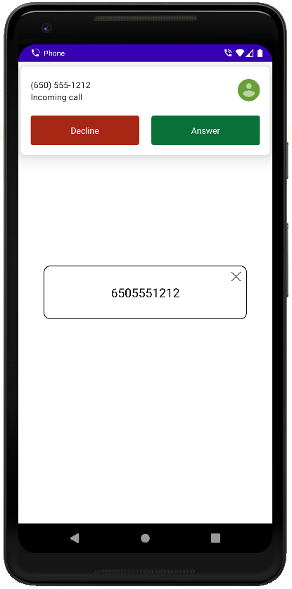

This Android app demonstrates examples of usage:
1. ```BroadcastReceiver``` for catching calls.
2. ```CallScreeningService``` for cathing calls with Android 10+.
3. Creating a window from the ```BroadcastReceiver```/```CallScreeningService```.
4. Dragging the created window.

The following permissions are required to complete these steps:
1. ```android.permission.READ_PHONE_STATE```.
2. ```android.permission.READ_CALL_LOG```.
3. ```android.permission.READ_CONTACTS``` for Android 10+.
4. ```android.permission.SYSTEM_ALERT_WINDOW```.

> [!NOTE]
> [Request Permissions Tool](https://github.com/merail/android-request-permissions-tool) is used for handling permissions. 

Handling of incoming calls will also work when the application is closed and after a device reboot.

**Note**: Android Marshmellow may have problems with handling due to security policy.



